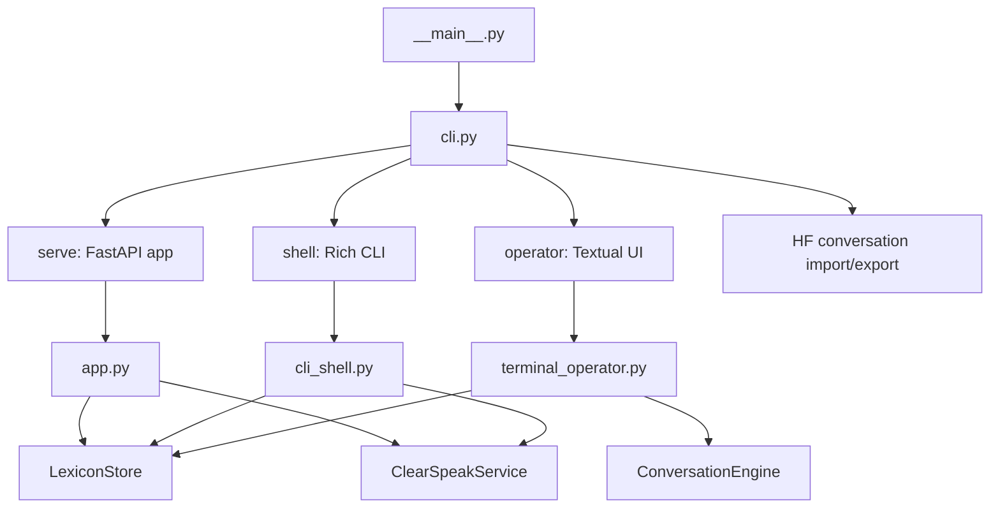
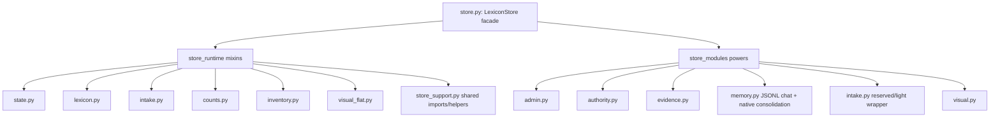
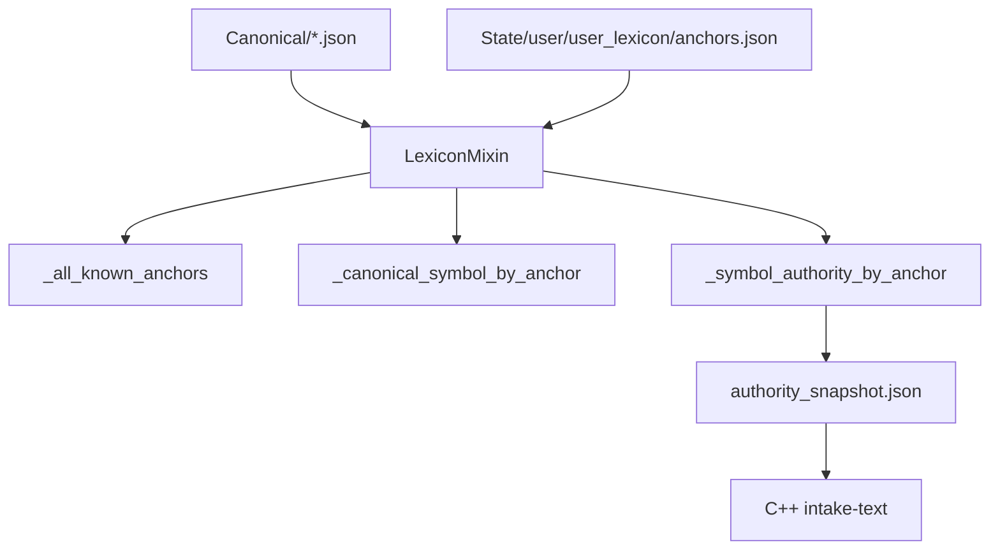
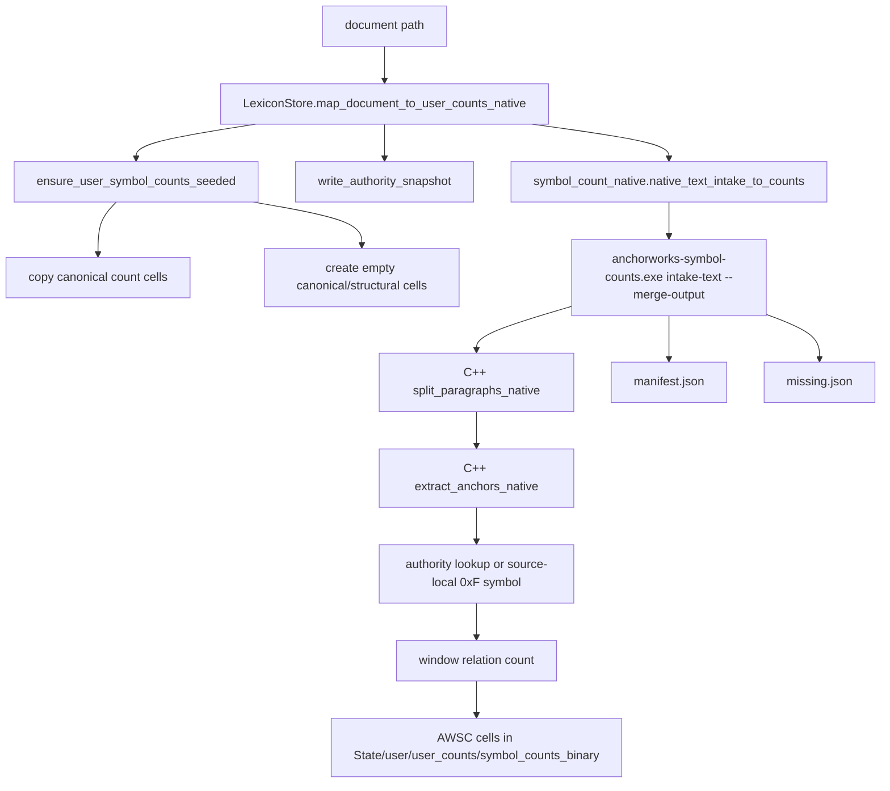
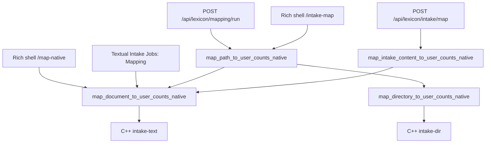
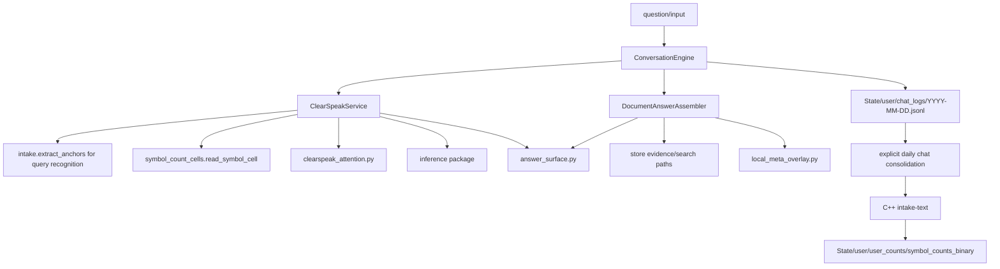
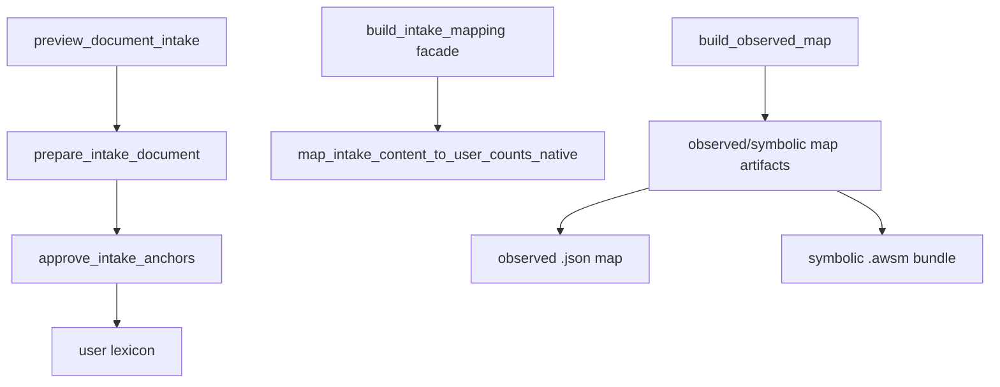
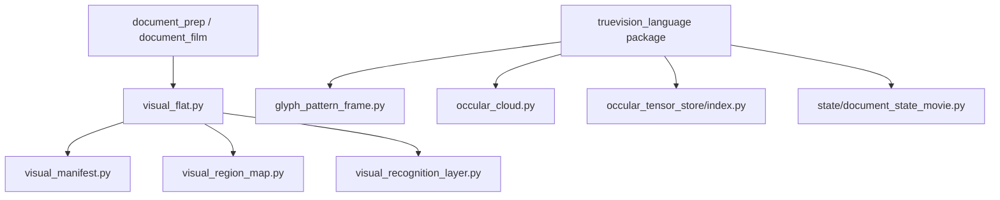
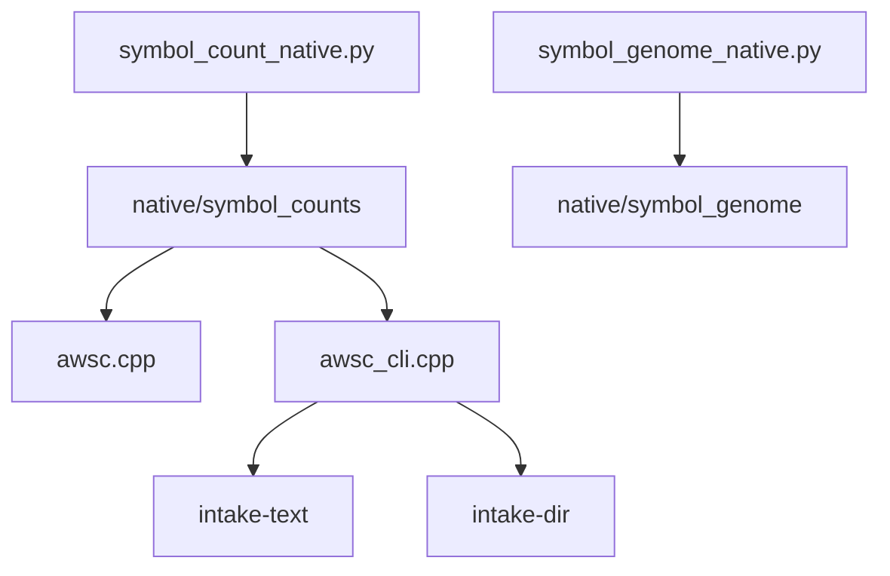

# AnchorWorks Code System Diagram

Generated from the current code shape. This is a code-reality map, not a product plan.

## Runtime Entrypoints



Why:

- `__main__.py` only calls `cli.main`.
- `cli.py` owns process-level mode selection: server, Rich shell, Textual operator, and corpus import/export.
- `app.py`, `cli_shell.py`, and `terminal_operator.py` are the three current user-facing surfaces.
- All three construct or depend on `LexiconStore`.

## Store Spine



Why:

- `LexiconStore` is still the public facade.
- Runtime behavior is split through mixins imported from `store_runtime/__init__.py`.
- `store_support.py` is a broad shared import/helper module used by the mixins. It is still a coupling hub.
- `store_modules/memory.py` owns the daily JSONL working chat record and the explicit native consolidation path into user AWSC counts.

## Lexicon And Symbol Authority



Why:

- Canonical remains the read-only base.
- User lexicon is the living observed-acceptance layer.
- `_symbol_authority_by_anchor()` returns canonical/user symbols and authority labels.
- `write_authority_snapshot()` serializes that authority for C++.

Current lanes:

```text
canonical        -> lane 0
math_companion   -> lane 1
structural       -> lane 2
source_local     -> lane 4
user_lexicon     -> lane 5
```

## Native User Mapping And Counts



Why:

- Python orchestration writes the authority snapshot and invokes the executable.
- User counts are seeded by copying canonical count cells and creating empty AWSC placeholders for every canonical/structural base symbol.
- User growth updates the seeded user-side cells; it does not mutate the canonical count root.
- C++ owns anchor walking, source-local symbol assignment, relation/window counting, and AWSC writes.
- The tested path uses `--merge-output`, so it writes directly into AWSC cells instead of staging giant AWSS files.

Native formula:

```text
for each paragraph:
  anchors = extract_anchors_native(paragraph)
  resolved = authority lookup or source-local 0xF fallback
  for each resolved root at position i:
    for offset in [-window_radius, +window_radius], excluding 0:
      if neighbor is resolved:
        relation[root_symbol, neighbor_symbol, offset, neighbor_lane, root_lane] += 1
```

Source-local formula:

```text
hash = FNV1a64(source_id + "\n" + anchor)
symbol = 0xF000000000 | (hash & 0x0FFFFFFFFF)
lane = 4
```

## Current Mapping Surfaces



Why:

- `/api/lexicon/mapping/run` now accepts a file or directory and dispatches into the native user-count path.
- `/api/lexicon/intake/map` stages inline content, then calls the native user-count path.
- `/map-native <path>` and `/intake-map <path>` use the same native dispatcher.
- Textual operator Mapping accepts a file or directory and uses the same native dispatcher.
- Directory mapping is one native `intake-dir` call; Python does not walk and count files itself.

## ClearSpeak And Conversation Path



Why:

- Conversation input is routed through `ConversationEngine`.
- If `record_chat=true`, the conversation turn is appended to the JSONL working record only.
- ClearSpeak uses Python query recognition and AWSC cell reads; it does not build ingest counts.
- `DocumentAnswerAssembler` is the document-evidence answer path.
- Chat append never writes counts silently. Daily consolidation is an explicit operator/API action and uses the native C++ count path.

Active chat memory formula:

```text
record_chat
  -> append JSONL turn with block_id + line_id
  -> counts_written = false

chat consolidate day
  -> write prepared text from clean_text lines
  -> C++ intake-text
  -> user AWSC count cells
  -> consolidation receipt
```

## Intake And Review Paths



Why:

- Preview/prepare/approve still support lexicon review and user lexicon additions.
- `build_intake_mapping` is now a compatibility facade into native inline-content mapping.
- The older `build_observed_map` path still exists in code and still does Python anchor-map/symbolic-map generation for legacy artifact review.
- That older observed-map path is separate from active user-count mapping and should not be used for large count-producing ingestion.
- Observed-map and symbolic-map API mouths are locked with HTTP 410; active mapping/count evidence comes from native user AWSC counts.

Important active mapping endpoints:

```text
POST /api/lexicon/intake/map -> map_intake_content_to_user_counts_native -> C++ ingest
Rich shell /intake-map       -> map_path_to_user_counts_native -> C++ ingest
```

## TrueVision / Visual Code Cluster



Why:

- Visual and TrueVision modules exist as local method/runtime code.
- Several TrueVision modules are not currently wired into the main CLI/API surfaces.
- They should be treated as method libraries or review candidates unless a specific route imports them.

## Native Code Cluster



Why:

- `symbol_count_native.py` builds/calls the C++ count executable.
- It no longer packs AWSS or builds count streams in Python.
- `native/symbol_counts` owns count-producing ingest for files and directories.
- `native/symbol_genome` exists for genome operations.

## Legacy / Review List

These are present in code and need operator review. “Not in use” here means not wired into the current main CLI/API/operator path by direct imports, or replaced by a newer native path.

### Legacy Active, Needs Decision

```text
src/AnchorWorks/store_runtime/intake.py
  build_intake_mapping is now a compatibility facade into native inline-content mapping.
  build_observed_map still exists for legacy observed/symbolic map artifacts.
  Not reached by /api/lexicon/intake/map or /intake-map after the native route change.

Legacy observed-map API mouths
  /api/lexicon/observed-maps, /api/lexicon/observed-map/{name}
  /api/lexicon/symbolic-maps, /api/lexicon/symbolic-map/{name}
  /api/awsg/*
  /api/resonance/source-local/build
  /api/flat-documents/runtime/build
  Locked with HTTP 410.

src/AnchorWorks/intake.py
  Python anchor extraction/map helpers still support query recognition, previews, and legacy observed maps.
  Not count-producing after the native count purge, but still important.

src/AnchorWorks/document_answer.py
  Builds local document count indexes at answer time for evidence rendering.
  This is not ingest-count writing, but it is Python relation-style logic and should be reviewed.
```

### Replaced / Removed Path

```text
src/AnchorWorks/symbol_relation_counts.py
  Deleted. Python relation/window count builder removed.

Python AWSS builders
  Removed from symbol_count_native.py.

symbolic-batch-intake / symbolic-batch-intake-chunked
  Removed from CLI surface.
```

### Present But Not Wired Into Main Runtime Surfaces

From reverse-import scan, these look like standalone tools, old experiments, or libraries awaiting explicit routing:

```text
src/AnchorWorks/code_lexicon_mirror.py
src/AnchorWorks/four_anchor_unit_counts.py
src/AnchorWorks/grounded_mode.py
src/AnchorWorks/lexicon_genome_rebuild.py
src/AnchorWorks/ocr_backend.py
src/AnchorWorks/visual_black_pixel_reconstruction.py
src/AnchorWorks/visual_pps_trial.py
src/AnchorWorks/visual_region_generation.py
```

TrueVision modules present but not connected to the main CLI/API/operator route stack:

```text
src/AnchorWorks/truevision_language/intake/glyph_pattern_frame.py
src/AnchorWorks/truevision_language/method_boundary.py
src/AnchorWorks/truevision_language/occular_cloud_accel.py
src/AnchorWorks/truevision_language/occular_tensor_index.py
src/AnchorWorks/truevision_language/state/document_state_movie.py
```

Inference package modules appear as package-internal exports/libraries rather than direct top-level routes:

```text
src/AnchorWorks/inference/answer_plan.py
src/AnchorWorks/inference/candidate_collector.py
src/AnchorWorks/inference/contracts.py
src/AnchorWorks/inference/engine.py
src/AnchorWorks/inference/frame_builder.py
src/AnchorWorks/inference/rules.py
```

## Current Tests

The current remaining tests are contract tests for the new native-count boundary:

```text
tests/test_native_count_cli_surface.py
tests/test_native_count_executable.py
tests/test_native_count_ingest_governance.py
tests/test_native_count_routes.py
tests/test_native_mapping_ui_surfaces.py
tests/test_native_user_mapping_pipeline.py
```

They assert:

```text
Python count-producing ingest symbols stay removed.
Old Python symbolic batch commands stay absent.
Binary build route fails hard.
Mapping route uses native user-count pipeline.
Native executable writes AWSC cells directly.
CLI/operator expose mapping.
```

## Current Proof Artifact

The repo doc was mapped through the user pipeline:

```text
source:
  docs/ANCHORWORKS_CURRENT_REALITY.md

runtime:
  native_cpp_intake_text

output:
  State/user/user_counts/symbol_counts_binary

proof:
  raw_text_in_count_spine: false
  record_count: 7882
  relation_observation_count: 9310
  anchor_observation_count: 945
  source_local_symbol_count: 19
  updated_cell_count: 303
  AWSC verify: 1110 checked, 0 errors
```
